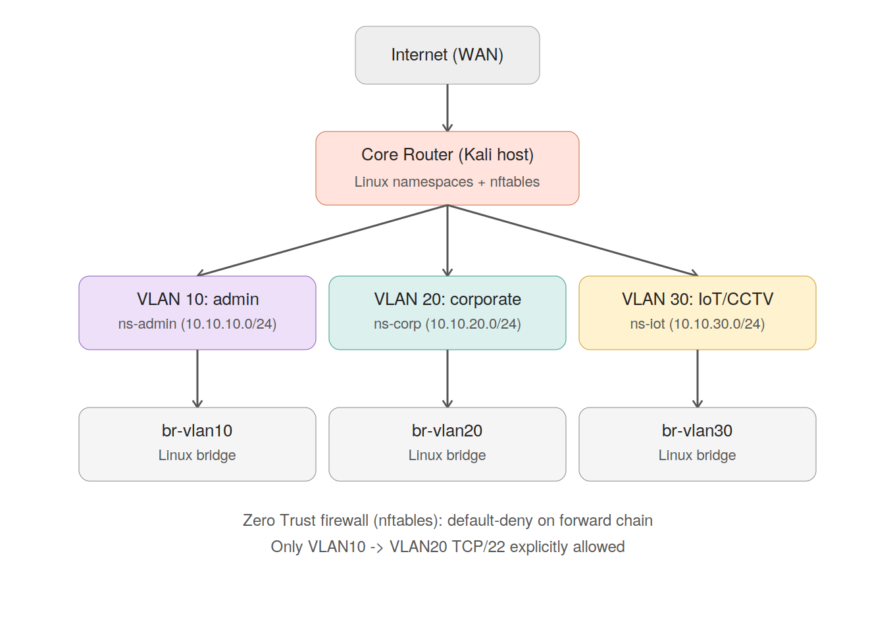
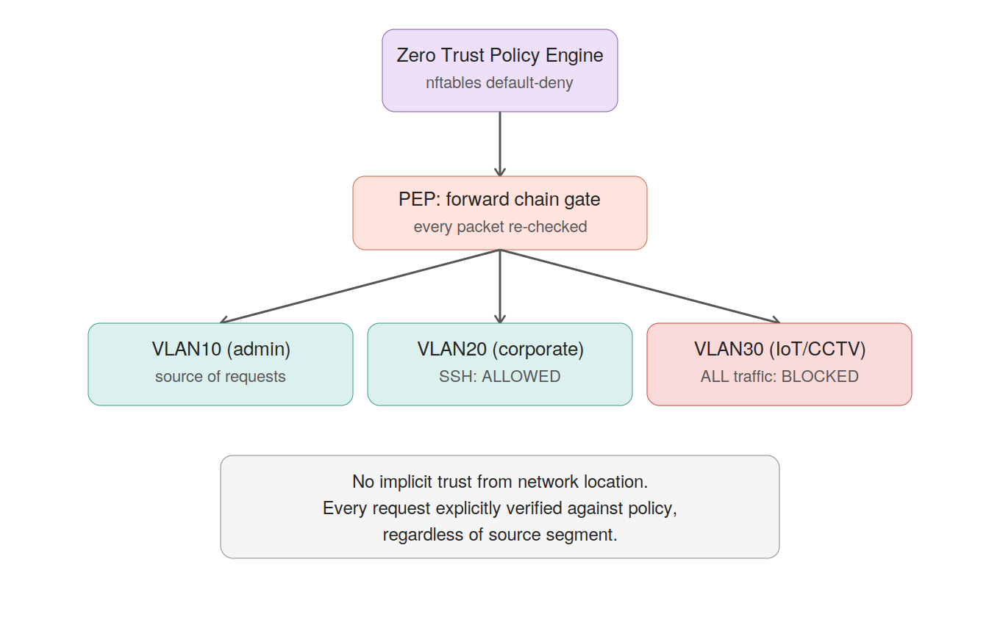

# Enterprise Network Lab — Zero Trust Simulation

A fully isolated home-lab that builds a segmented, enterprise-style network — admin, corporate, and IoT/CCTV zones — then measures the real difference between a flat, unsegmented network and one enforcing Zero Trust principles (NIST SP 800-207).

> **Lab disclaimer:** all software, virtual infrastructure, and network components used in this project are self-owned and run in an isolated, offline lab environment. No third-party or production systems are involved. This project is for education, portfolio, and research purposes only.

---

## Why this project

Most home-lab security projects stop at "I attacked my own router." This one goes further: it builds a small segmented network resembling a business environment, attacks it in its default (flat, perimeter-only) state, re-architects it around Zero Trust principles, and re-runs the same attacks — producing a measurable, documented before/after comparison instead of a one-off demo.

## Architecture




- **VLAN 10 (10.10.10.0/24)** — Admin / attacker segment
- **VLAN 20 (10.10.20.0/24)** — Corporate segment
- **VLAN 30 (10.10.30.0/24)** — IoT / CCTV segment
- **Gateway** — the lab host itself, acting as router via Linux IP forwarding
- **Policy enforcement** — nftables default-deny firewall on the forward chain

The network is emulated with **Linux network namespaces and virtual bridges** rather than separate virtual machines. This avoids hypervisor-specific compatibility issues (see [`01-topology/router-os-choice.md`](01-topology/router-os-choice.md)) and uses the same underlying kernel primitives as tools like Docker and Mininet — while remaining fully scriptable and reproducible on a single host.

## Results at a glance

| Test | Before (Flat Network) | After (Zero Trust) |
|---|---|---|
| VLAN10 → VLAN20, ICMP (ping) | Success, 0% loss | Blocked |
| VLAN10 → VLAN30, ICMP (ping) | Success, 0% loss | Blocked |
| VLAN10 → VLAN20, TCP/22 (SSH) | N/A | Allowed (explicit policy) — verified via real login |
| Nmap host discovery, VLAN20/30 | Host up | Host reported **"down"** (ICMP not whitelisted) |
| Nmap forced scan (`-Pn`), VLAN30 | 6 ports closed (host visible) | **6 ports filtered** (host effectively invisible) |

Full data: [`04-attack-vs-defense/comparison-table.md`](04-attack-vs-defense/comparison-table.md) · Raw scans: [`04-attack-vs-defense/nmap-scans/`](04-attack-vs-defense/nmap-scans/)

**Key finding:** default-deny enforcement didn't just block traffic — it removed the protected segments from standard attacker reconnaissance entirely, since Nmap's default ICMP-based host discovery failed silently against them. A "filtered" port is indistinguishable from a non-existent host, which is a meaningfully stronger security posture than "closed" ports on a reachable host.

## Project structure

```
01-topology/                    architecture diagrams, VLAN plan, platform decision log
02-flat-network-baseline/       baseline attack results with no segmentation controls
03-zero-trust-implementation/   nftables rules + setup/teardown/start scripts
04-attack-vs-defense/           before/after comparison data and nmap scans (core dataset)
05-monitoring/                  IDS rules (planned)
research-notes/                 literature review, methodology, results, and paper draft
troubleshooting-log.md          documented debugging case studies
```

## Reproducing this lab

Everything is scripted. On a Debian/Kali-based host with `nftables`, `iproute2`, and `nmap` installed:

```bash
git clone https://github.com/Anam-Batool-12/Enterprise-Network-Lab-Zero-Trust-Simulation.git
cd Enterprise-Network-Lab-Zero-Trust-Simulation
sudo bash 03-zero-trust-implementation/start-lab.sh
```

This single command disables conflicting host firewalls (UFW), builds the full VLAN topology, applies the Zero Trust policy, and starts required services. Then verify:

```bash
# Should fail (default-deny)
sudo ip netns exec ns-admin ping -c 3 10.10.30.50

# Should succeed (explicitly allowed)
sudo ip netns exec ns-admin ssh root@10.10.20.50
```

To reset the environment: `sudo bash 03-zero-trust-implementation/teardown-lab.sh`

## Troubleshooting log

Four non-trivial issues were diagnosed and resolved during implementation, each documented as a full case study (Problem → Investigation → Root Cause → Fix → Verification → Lesson) in [`troubleshooting-log.md`](troubleshooting-log.md):

1. Host-originated traffic bypassing the netfilter `FORWARD` chain
2. Firewall rules referencing veth port names instead of bridge devices
3. Reverse-path filtering (`rp_filter`) investigated and ruled out
4. A second, independently-registered firewall table (UFW) silently dropping traffic alongside the custom policy

The most significant finding — that the absence of drop-counter activity in one firewall table does not prove that table is not responsible for observed packet loss — is detailed in Case 4.

## Tools used

`nftables` · `iproute2` (network namespaces, bridges, veth) · `nmap` · `OpenSSH` · Bash · Git

## Research paper

This repository is the working dataset for a paper on implementing and validating Zero Trust network policies in a reproducible, low-cost testbed. Draft materials, an 11-paper literature review, and the current paper draft are in [`research-notes/`](research-notes/), including [`research-notes/zero-trust-paper.pdf`](research-notes/Zero_Trust_Testbed_Paper(1).docx
).

## Roadmap

- [x] Design and build segmented network topology
- [x] Establish flat-network baseline (no controls)
- [x] Implement and verify default-deny Zero Trust policy
- [x] Document implementation challenges as case studies
- [x] Simulate attacker reconnaissance (Nmap) before/after enforcement
- [ ] Add intrusion detection (Suricata) on `ZT-DROP` events
- [ ] Complete formal citations and submit research paper

## Author

Anam Batool — built and documented as part of an ongoing cybersecurity portfolio.
